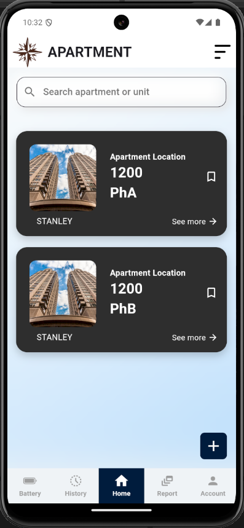

# 🏢 Apartment Inspection Application

A modern and intuitive **Apartment Inspection App** built with **Flutter**, powered by **Firebase** backend services, **GetX** for smooth state management, and **SharedPreferences** for local storage.  
This application simplifies the inspection process, making property management efficient and organized.

---

## ✨ Features

- 📝 Create, view, and manage apartment inspections
- 📸 Attach images and notes during inspections
- 🔥 Real-time synchronization with Firebase Firestore
- ⚡ Seamless and reactive UI with GetX State Management
- 💾 Local data persistence with SharedPreferences
- 🔔 Notification-ready architecture (optional future expansion)
- 🧹 Clean architecture and modular codebase
- 🔒 Secure authentication integration (Firebase Auth)

---

## 📱 Screenshots

| Home Screen | Inspection Detail | New Inspection |
|:-----------:|:------------------:|:--------------:|
|  |  |  |

*(Optional: replace with actual screenshots of your app.)*

---

## 🛠️ Built With

- **Flutter** — Build beautiful native apps
- **Firebase Firestore** — Cloud database
- **Firebase Authentication** — User sign-in
- **GetX** — State Management & Navigation
- **SharedPreferences** — Local Storage
- **Dart** — Programming Language

---

## 🧩 Architecture Overview

```plaintext
lib/
├── controllers/      # GetX Controllers (business logic)
├── models/           # Data models (Inspection, User)
├── services/         # Firebase & Local Storage services
├── views/            # UI screens and widgets
├── bindings/         # GetX dependency injections
├── routes/           # App navigation routes
└── main.dart         # App entry point
```

> Clean and scalable project structure following best practices.

---

## 🚀 Getting Started

Follow these steps to run the project locally:

1. **Clone the repository**

```bash
git clone https://github.com/yourusername/apartment-inspection-app.git
cd apartment-inspection-app
```

2. **Install dependencies**

```bash
flutter pub get
```

3. **Setup Firebase**

- Create a Firebase project.
- Enable Authentication and Firestore Database.
- Download `google-services.json` (Android) and `GoogleService-Info.plist` (iOS) and place them correctly.

4. **Run the app**

```bash
flutter run
```

---

## 🔑 Environment Configuration

Make sure you configure your Firebase settings and local environment correctly.  
Consider using `.env` files or secure vaults for storing API keys if needed.

---

## 📈 Future Improvements

- 📋 PDF export for inspection reports
- 📲 Push Notifications for updates
- 🧑‍🤝‍🧑 Role-based access control (Inspector/Admin)
- 🌐 Multi-language support
- 🎨 Dark Mode

---

## 🤝 Contributing

Contributions are welcome! 🎉  
Please fork this repository, make changes, and submit a pull request.

```bash
# Create a feature branch
git checkout -b feature/YourFeature

# Commit your changes
git commit -m 'Add some feature'

# Push to the branch
git push origin feature/YourFeature
```

---

## 📄 License

This project is licensed under the [MIT License](LICENSE).

---

## 💬 Connect with Me

- [LinkedIn](https://www.linkedin.com/in/s4k1l)
- [Fiverr](https://www.fiverr.com/users/shakil_app_dev)

---

> **Crafted with ❤️ using Flutter, Firebase, and GetX.**
